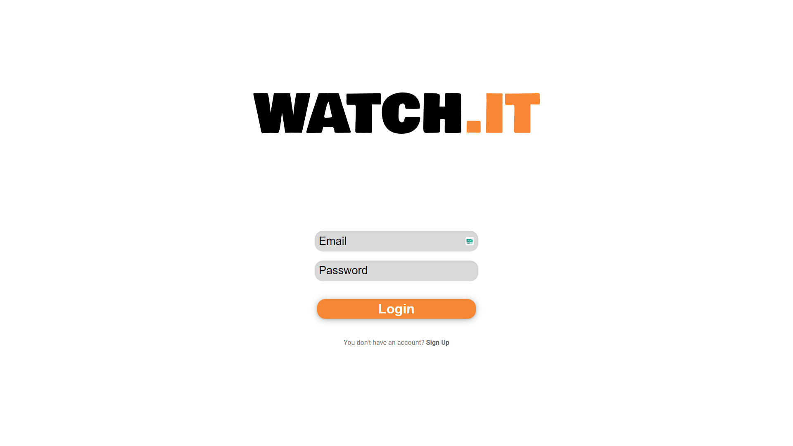
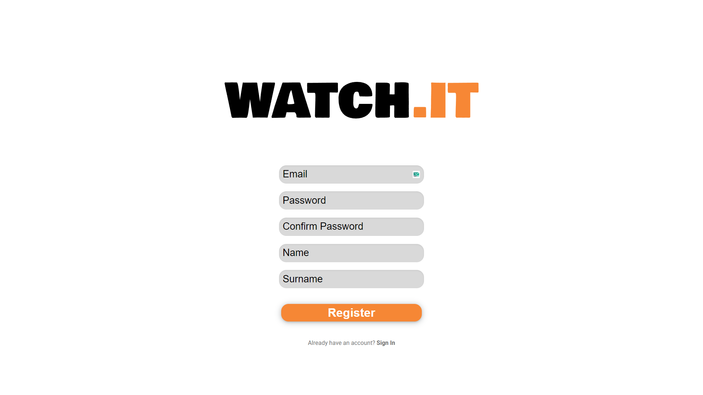
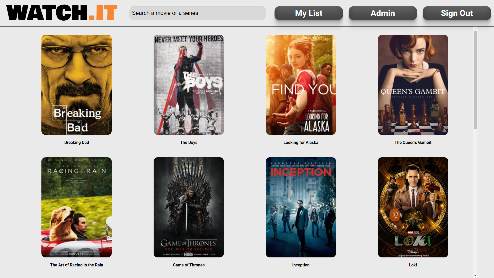
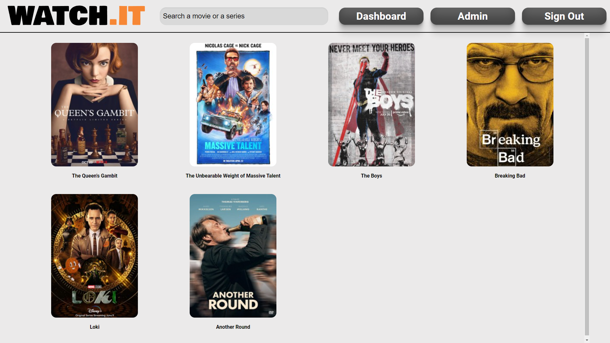
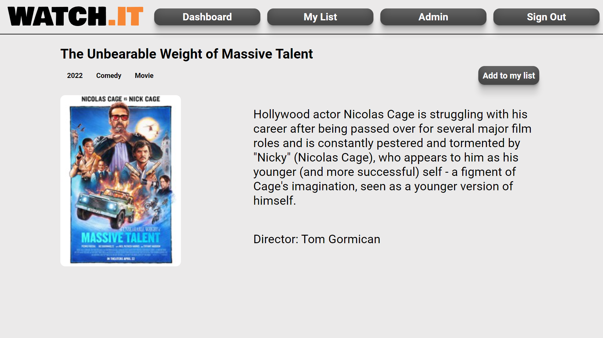
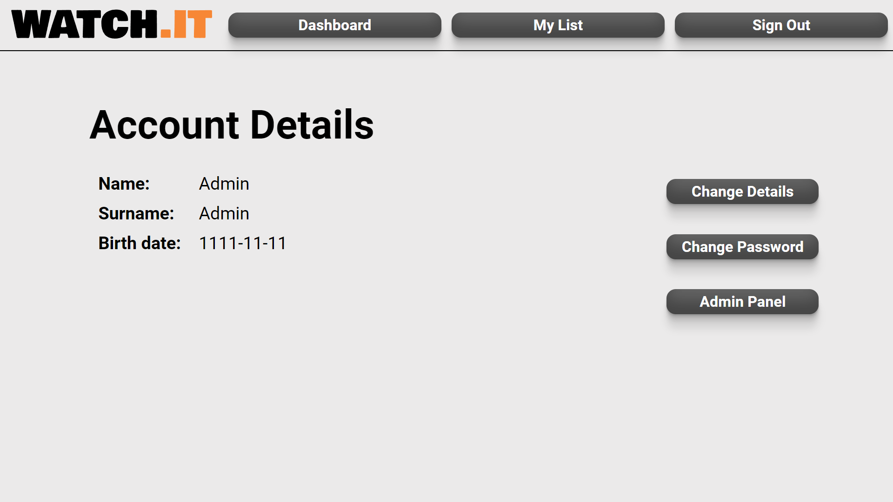

# WATCH.IT

The app allows users to browse a wide list of movies and series. Each position can be added to or removed from user's personal list of favourites at any time. The goal of the project is to provide a repository where users can list all the movies and series they watch on any VOD service.

## Table of Contents

- [Installation](#installation)
- [Technologies](#technologies)
- [Usage](#usage)
- [Features](#features)
- [Author](#author)

## Installation

1. Clone the repository
2. Run Spring Boot application
3. Download Node.js environment
4. Install Vite and run React app from "/frontend" directory:
    ```
    npm run dev
    ```

## Technologies

Front-end: React, JavaScript, CSS

Back-end: Spring Boot, PostgreSQL

## Usage

1. Registration and login:

   Account is mandatory for user's personal favourites list, although the database and details of movies and series can be viewed without it.

   
   

2. Dashboard:

   Here users can find and browse all the movies and series in app's database.

   

3. My List:

   Here users can find and browse all the movies and series from their personal favourites list.

   

4. Movie/Series Details:

   Here users can find more about a particular movie or series, as well as add it to or remove from their personal favourites list.

   

5. User Profile:

   Here users can find their account details, edit those details and change their password. Accounts with admin rights can also access admin panel that allows them to edit and expand the database of movies/series.

   

## Features

- Spring Security Authorization using JWT
- CRUD REST API with Hibernate+PostgreSQL database

## Author

Kamil Gowin